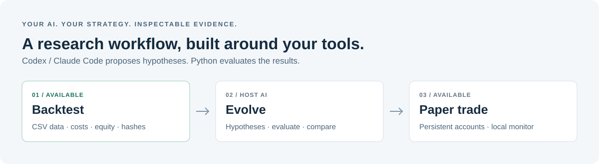

<div align="center">

# QuantEvo Skill

**让你已有的 AI 工具，具备策略研究能力。**

回测 · 自进化 · 模拟运行

[English](README.md) | [简体中文](README.zh-CN.md)


[快速开始](#快速开始) · [功能状态](#功能状态) · [路线图](#路线图) · [文档导航](#文档导航)

</div>



QuantEvo Skill 是面向 **Codex 和 Claude Code** 的本地策略研究技能。沿用你已有的 AI 配置，理解策略、执行确定性的评测，并提出可检验的优化假设。QuantEvo 内部无需再配置一套 LLM API。

项目目标是打通可复现回测、策略自进化和持续模拟账户，并通过本地网站查看运行状态。

> **当前版本：** 已支持本地 CSV 上的单标的 SMA 交叉策略回测。持久化自进化、前向模拟和监控网站尚在规划中。基础版本不发送真实订单。

## 为什么使用 QuantEvo？

策略假设需要能检查的评测证据。QuantEvo 把 AI 研究对话连接到可执行工具，让每个结果都有明确口径。

| 原则 | 使用方式 |
| --- | --- |
| **沿用自己的 AI** | 通过已配置的 Codex 或 Claude Code 进行研究。 |
| **用程序计算** | Python 计算成交、费用、净值与评测指标。 |
| **保留可核查证据** | JSON 结果包含参数、成交、净值及输入的 SHA256 指纹。 |
| **从本地开始** | 内置评测器不需要网络或第三方运行依赖。 |
| **检验优化效果** | 研究设计保留基线、固定评测规则与候选历史。 |

本地执行不等于模型在本地推理：AI 工具向模型提供方发送什么，仍取决于该工具自身的配置。

## 功能状态

| 能力 | 状态 | 当前范围 |
| --- | --- | --- |
| Codex / Claude Code 技能安装 | ✅ 可用 | 一份共享 skill，附带 Python 工具 |
| 策略回测 | ✅ 可用 | JSON `sma_cross`、单标的、仅做多、本地 OHLCV CSV |
| 成本与评测证据 | ✅ 可用 | 手续费、滑点、夏普率、回撤、成交、净值及输入哈希 |
| AI 辅助参数探索 | 🧪 手动编排 | 宿主 AI 提出修改；用户准备数据分段并分别保存结果 |
| 持久化策略自进化 | 🗓 规划中 | 实验预算、试验历史、候选选择与最终检查 |
| 前向模拟账户 | 🗓 规划中 | 行情接入、固定版本、持久化与重启恢复 |
| 本地监控网站 | 🗓 规划中 | 净值、持仓、成交及行情与后台进程状态 |

运行 `doctor` 可查看已安装版本的机器可读能力清单。

## 快速开始

**环境要求：** Python 3.9+。使用 skill 需要已配置的 Codex 或 Claude Code；命令行工具可独立运行。

### 1. 获取项目

```bash
git clone https://github.com/EthanAlgoX/QuantEvo-Skill.git
cd QuantEvo-Skill
python3 skills/quantevo/scripts/quantevo.py doctor
```

### 2. 运行示例回测

以下行情为**合成数据**，仅用于验证安装。请在仓库根目录执行，并使用尚不存在的输出路径。

```bash
python3 scripts/make_demo.py --output demo.synthetic.csv

python3 skills/quantevo/scripts/quantevo.py backtest \
  --strategy examples/sma-cross.json \
  --data demo.synthetic.csv \
  --initial-cash 10000 \
  --fee-bps 10 \
  --slippage-bps 5 \
  --periods-per-year 365 \
  --output demo.backtest.json
```

打开 `demo.backtest.json`，查看评测设置、指标、成交、净值曲线与来源指纹。已有输出文件会保留；重新运行时请改用新路径。

### 3. 安装技能

选择对应客户端，也可以安装到两个客户端：

```bash
python3 scripts/install_skill.py --client codex
python3 scripts/install_skill.py --client claude
```

| 客户端 | 默认安装目录 |
| --- | --- |
| Codex | `~/.codex/skills/quantevo`，支持 `CODEX_HOME` |
| Claude Code | `~/.claude/skills/quantevo` |

已有同名技能会保留并停止安装。可用 `--destination /absolute/path/to/skills` 指定其他技能父目录。安装后在客户端重新加载技能。

然后向 AI 工具提出任务：

> 使用 QuantEvo 评测我的 SMA 策略和这份日线 CSV。报告手续费、夏普率、最大回撤和交易活动，解释评测设置，并提出一个可检验的参数修改假设。

### 可选：安装命令行工具

在你的 Python 环境中执行：

```bash
python3 -m pip install -e .
quantevo doctor
```

Python 包安装的是 CLI；技能仍需通过上面的安装脚本单独安装。

## 使用自己的策略与行情

基础版本接受以下 JSON 策略格式：

```json
{
  "schema": "quantevo.strategy.v1",
  "kind": "sma_cross",
  "fast": 10,
  "slow": 30,
  "position_weight": 0.5
}
```

提供按时间升序排列、带时区的已收盘 OHLCV CSV：

```csv
timestamp,open,high,low,close,volume
2026-01-01T00:00:00Z,100,103,99,102,1500
2026-01-02T00:00:00Z,102,104,100,101,1700
```

这两行仅展示格式；实际回测至少需要 `slow + 2` 行。

| 设置 | 基础版本行为 |
| --- | --- |
| 信号与成交 | 已收盘 K 线产生 SMA 交叉信号 → 下一根输入 K 线开盘成交 |
| 账户模型 | 单标的、仅做多、允许小数持仓；`position_weight` 决定入场金额 |
| 成本 | 计入手续费与不利方向滑点 |
| 年化口径 | 显式设置 `--periods-per-year`：股票日线通常 252，加密日线 365，加密小时线 8760 |
| 指标与期末持仓 | 指标包含预热阶段；期末持仓按最后收盘价计值，不强制平仓 |
| 尚不支持 | 任意 Python 策略、杠杆、资金费率、部分成交与公司行动 |

解读年化指标前需要检查不规则采样与缺失 K 线。评测器报告回撤，但不会执行回撤上限风控。详细规则见[回测合同](skills/quantevo/references/backtest.md)。

## 路线图

- [x] **基础工具：** 可移植 skill、CSV 校验、确定性回测与 JSON 证据。
- [ ] **自进化研究：** 固定研究合同、持久化实验、预算、候选选择与最终评测。
- [ ] **模拟运行：** 先接追加式 CSV，再接市场行情源与可恢复账户。
- [ ] **本地监控：** 展示研究结果、前向账户表现与运行健康状态。
- [ ] **发行完善：** 扩展策略接口、完善发行文档与正式许可证。

自进化由宿主 AI 提出修改，程序负责评测；**没有找到改进**也应是有效结果。模拟后台进程将独立于 AI 对话运行，并固定所执行的策略版本。

## 文档导航

| 文档 | 内容 |
| --- | --- |
| [技能入口](skills/quantevo/SKILL.md) | 两个客户端共用的研究流程 |
| [回测合同](skills/quantevo/references/backtest.md) | 已实现的格式、成交与指标规则 |
| [自进化合同](skills/quantevo/references/evolution.md) | 规划中的研究生命周期及手动探索边界 |
| [模拟运行合同](skills/quantevo/references/paper.md) | 规划中的前向模拟行为 |
| [架构与实施路线](docs/architecture.md) | 模块职责及实施顺序 |
| [ai-berkshire 参考分析](docs/reference-ai-berkshire.md) | 工作流与工具分工的参考依据 |

## 参与贡献

欢迎贡献策略适配器、研究记录、行情接入、测试和双语文档。开发前请阅读[项目架构](docs/architecture.md)和[共享开发规则](AGENTS.md)。

修改运行工具后执行：

```bash
python3 -m unittest discover -s tests -v
```

请保持英文和中文 README 内容对应，清楚区分已实现功能与路线图。

## 致谢与许可证

参考了 [ai-berkshire](https://github.com/xbtlin/ai-berkshire) 用 skill 组织研究流程、用可执行工具支持计算的设计。QuantEvo 采用独立实现。

目前尚未确定正式许可证。仓库已公开，发行许可证仍在路线图中。
